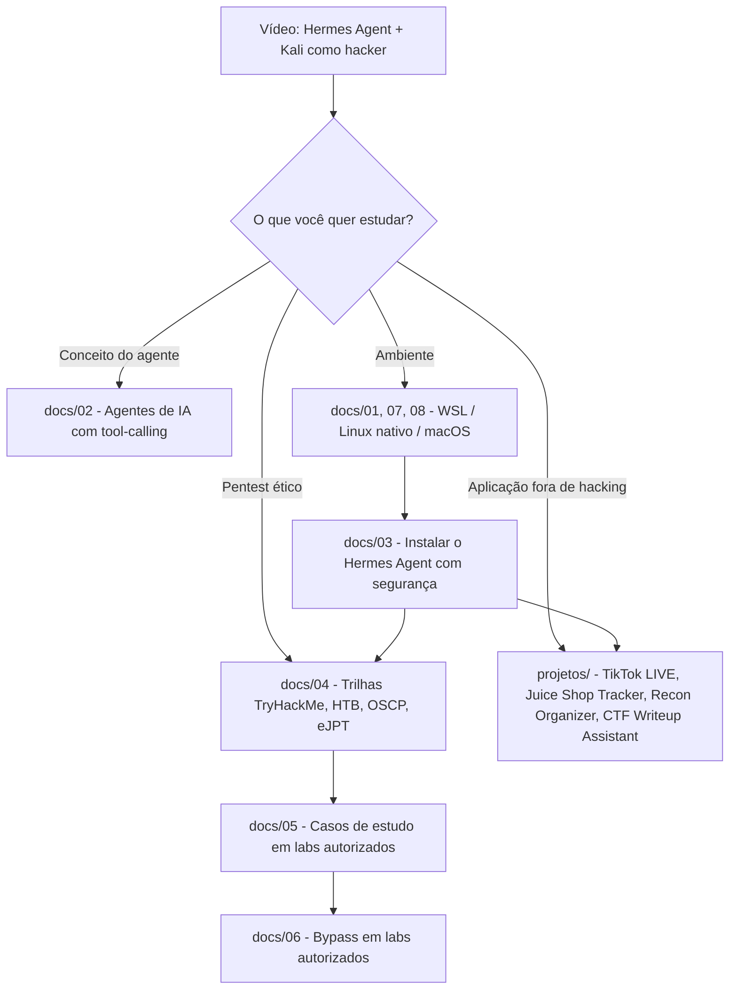
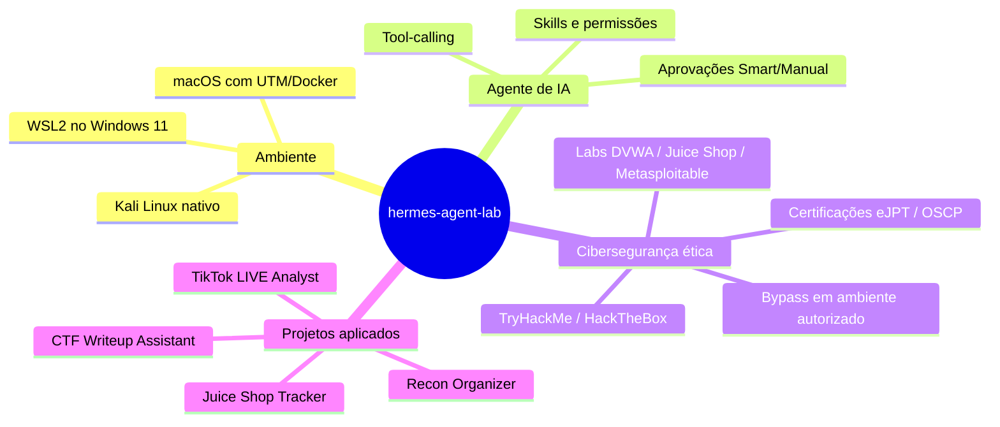

# hermes-agent-lab

  

Repositório de estudos sobre **agentes de IA com tool-calling** (Hermes Agent, da Nous Research), cobrindo instalação em **Windows 11 (WSL2), Linux nativo e macOS**, e organizado em dois eixos:

1. **Conceitos e trilhas legítimas de cibersegurança** — como um agente de IA se encaixa em pentest, e como estudar isso de verdade (labs autorizados, certificações, técnicas de bypass ensinadas em plataformas de treino).
2. **Projetos aplicados fora de hacking** — mostrando que a mesma base técnica (agente + tool-calling) serve pra qualquer domínio.

Ponto de partida: o vídeo [*"Crie seu próprio hacker com IA grátis e ilimitado"*](https://www.youtube.com/watch?v=IxK_awn5xTs), que demonstra o Hermes Agent + Kali Linux como agente de pentest.

## Sumário

- [Aviso importante](#aviso-importante)
- [Como o repositório se encaixa](#como-o-repositório-se-encaixa)
- [Mapa de conceitos](#mapa-de-conceitos)
- [Estrutura de pastas](#estrutura-de-pastas)
- [Instalação por sistema operacional](#instalação-por-sistema-operacional)
- [Trilhas de estudo](#trilhas-de-estudo)
- [Projetos deste repositório](#projetos-deste-repositório)
- [Vídeos e leituras](#vídeos-e-leituras)
- [Créditos e licença](#créditos-e-licença)

## Aviso importante

Nada aqui deve ser usado contra sistemas, sites, contas ou transmissões que não sejam suas ou que você não tenha autorização explícita e por escrito para testar. Isso inclui sites de terceiros, redes de terceiros, contas de outras pessoas e qualquer serviço em produção sem escopo formal de teste. Agentes autônomos com acesso a shell são poderosos, e usar isso sem autorização é crime (no Brasil, invasão de dispositivo informático, art. 154-A do Código Penal). Use apenas em laboratórios próprios ou plataformas feitas pra isso: DVWA, OWASP Juice Shop, Metasploitable, HackTheBox, TryHackMe.

## Como o repositório se encaixa



## Mapa de conceitos



## Estrutura de pastas

```text
hermes-agent-lab/
├── README.md
├── LICENSE
├── checklist-seguranca.md
├── docs/
│   ├── 01-wsl-e-kali.md
│   ├── 02-agentes-de-ia-tool-calling.md
│   ├── 03-instalar-hermes-agent.md
│   ├── 04-trilhas-legitimas-pentest.md
│   ├── 05-casos-de-estudo-labs-autorizados.md
│   ├── 06-bypass-em-labs-autorizados.md
│   ├── 07-instalar-linux-nativo.md
│   ├── 08-instalar-macos.md
│   └── 09-videos-e-leituras.md
└── projetos/
    ├── tiktok-live-analyst/
    ├── juice-shop-tracker/
    ├── recon-organizer/
    └── ctf-writeup-assistant/
```

## Instalação por sistema operacional

| Sistema | Caminho recomendado | Guia |
|---|---|---|
| Windows 11 | WSL2 + Kali (rápido) ou VirtualBox + Kali (mais isolado) | [`docs/01-wsl-e-kali.md`](docs/01-wsl-e-kali.md) |
| Linux (Debian/Ubuntu/Kali nativo) | Instalação direta ou container Docker | [`docs/07-instalar-linux-nativo.md`](docs/07-instalar-linux-nativo.md) |
| macOS (Intel ou Apple Silicon) | UTM (VM) ou Docker | [`docs/08-instalar-macos.md`](docs/08-instalar-macos.md) |

Depois de ter o Kali rodando (em qualquer SO), siga [`docs/03-instalar-hermes-agent.md`](docs/03-instalar-hermes-agent.md) — esse passo é igual nos três sistemas, porque acontece dentro do Linux.

## Trilhas de estudo

1. [`docs/02-agentes-de-ia-tool-calling.md`](docs/02-agentes-de-ia-tool-calling.md) — entenda o conceito antes de instalar qualquer coisa.
2. Escolha seu SO na tabela acima e prepare o ambiente.
3. [`docs/03-instalar-hermes-agent.md`](docs/03-instalar-hermes-agent.md) com o [`checklist-seguranca.md`](checklist-seguranca.md) ao lado.
4. [`docs/04-trilhas-legitimas-pentest.md`](docs/04-trilhas-legitimas-pentest.md) — labs e certificações.
5. [`docs/05-casos-de-estudo-labs-autorizados.md`](docs/05-casos-de-estudo-labs-autorizados.md) — ideias de uso do agente em labs.
6. [`docs/06-bypass-em-labs-autorizados.md`](docs/06-bypass-em-labs-autorizados.md) — técnicas de bypass ensinadas oficialmente em Juice Shop/PortSwigger, sempre em ambiente de treino.

## Projetos deste repositório

| Projeto | O que faz |
|---|---|
| [`projetos/tiktok-live-analyst/`](projetos/tiktok-live-analyst/) | Analisa gravações/transmissões de TikTok LIVE próprias para melhorar apresentação e vendas. |
| [`projetos/juice-shop-tracker/`](projetos/juice-shop-tracker/) | Agente que acompanha seu progresso nos desafios do OWASP Juice Shop e organiza anotações por categoria (incluindo bypass). |
| [`projetos/recon-organizer/`](projetos/recon-organizer/) | Agente que organiza saídas de nmap/gobuster/nikto rodadas manualmente por você em máquinas de laboratório (HTB/THM). |
| [`projetos/ctf-writeup-assistant/`](projetos/ctf-writeup-assistant/) | Agente que ajuda a transformar suas anotações de laboratório em writeups estruturados, no padrão usado pra portfólio/OSCP. |

Todos seguem o mesmo padrão: você faz o trabalho técnico manualmente (é isso que ensina), o agente organiza, explica e documenta.

## Vídeos e leituras

Lista curada em [`docs/09-videos-e-leituras.md`](docs/09-videos-e-leituras.md) — instalação de WSL/Kali, TryHackMe, HackTheBox (IppSec), OWASP Juice Shop e roadmap de OSCP.

## Créditos e licença

- Vídeo original: [O hacker cego — CRIE SEU PRÓPRIO HACKER COM IA GRÁTIS E ILIMITADO!](https://www.youtube.com/watch?v=IxK_awn5xTs)
- Manual do projeto TikTok LIVE: escrito pelo autor deste repositório.
- README e docs organizados com apoio do Claude (Anthropic).
- Licença: MIT — veja [`LICENSE`](LICENSE).
